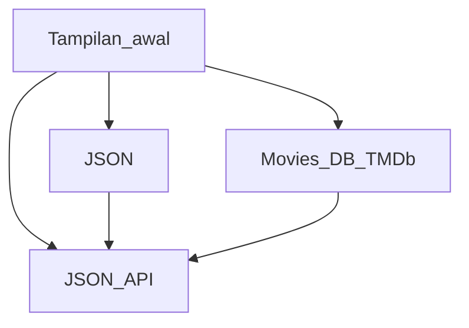

# Workshop Mobile Application based on Java
### Android Java Projects Practice Snippet
- [AppwithFragments](#fragment)
- [AppwithIntent](#intent)
- [ImplementasiSQLite](#implementasi-sqlite)
- [ManagementFile](#management-file)
- [RecycleView](#recyclerview)
- [Retrovolley](#retrovolley)
- [SelectionWidget](#selection-widget)
- [JsonAPI and MoviesDB](#jsonapi-and-moviesdb)
- [Flow](#flow)

> [!TIP]
> Repositori ini berisi aplikasi berbasis mobile menggunakan bahasa pemrograman JAVA. Rekomendasi penggunaan versi Gradle adalah versi 7.2 sampai 8.xx. Versi JDK yang digunakan minimum versi 11 keatas

### Selection Widget 

 

### RecyclerView

 

### Fragment

 

### Intent

 

### Management File

 

### Implementasi SQLite

 

### Retrovolley

 

### JsonAPI and MoviesDB
| Home | JSON | JSON API | Movies DB |
|------------|-----------------|-----------------|-----------------|
| |  | | 

https://github.com/user-attachments/assets/eed34add-1452-49af-a239-06c123ec5d0d

### Flow

